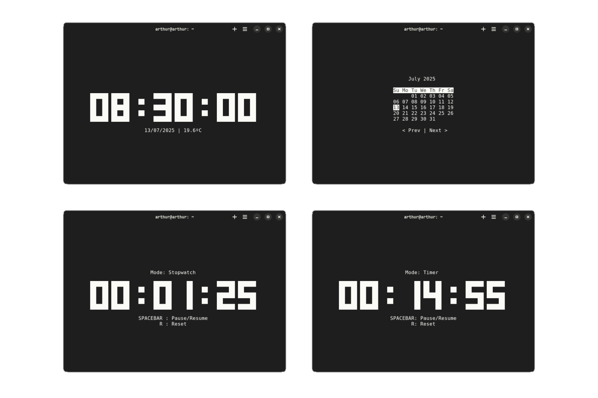

<div align="center">
 <h1>ClockTemp</h1>
 <b>ClockTemp</b> is a simple clock based on <a href="https://github.com/xorg62/tty-clock">tty-clock</a> that displays the date, time, and temperature.
 
</div>

## How to use

> [!IMPORTANT]
Prerequisites: [Python](https://www.python.org/) version 3.x and [requests](https://pypi.org/project/requests/) library

1. Clone the repository to have local access to all the necessary files. You can do this using the following command:
 ```
 git clone https://github.com/dantas-arthur/ClockTemp.git
 ```

2. On your terminal navigate to the project directory
  ```
  cd YOUR/DIRECTORY/ClockTemp/script
  ```
3. Run the <code>install.sh</code> file to install ClockTemp into your environment variables
 ```
 sudo ./install.sh
 ```
4. Now whenever you run the <code>clocktemp</code> command in your terminal the script will work
 ```
 clocktemp
 ```

> [!TIP]
Since ClockTemp has many customization options, you can create an alias in Bashrc to set the desired options once.

1. On your terminal open Bashrc
 ```
 nano ~/.bashrc
 ```
2. At the end of the file add your custom configuration
 ```
 alias clocktemp='clocktemp -tf YOUR_TIME_FORMAT -df YOUR_DATE_FORMAT -color YOUR_COLOR -tu YOUR_TEMPERATURE_UNITY -lat YOUR_LATITUDE -lon YOUR_LONGITUDE'
 ```
3. Save your changes pressing <code>CTRL + O</code> > <code>ENTER</code> and exit with <code>CTRL + X</code>
4. Apply changes
 ```
 source ~/.bashrc
 ```
## Command list

| COMMAND | CHOICES | DEFAULT | FUNCTION |
|:-------:|:-------:|:-------:|:--------:|
| -tf     | 12 / 24 |   12    | Change time format between 12-hour and 24-hour |
| -df     | MM/DD / DD/MM|   MM/DD    | Change date format between MM/DD/YYYY and DD/MM/YYYY |
| -tu     | c / f |   c    | Change temperature unity between Celsius and Fahrenheit |
| -s      | true / false |   true    | Display or hide seconds |
| -lat    | None |   None    | Use user's latitude to get weather data from Open-Meteo API |
| -lon    | None |   None    | Use user's longitude to get weather data from Open-Meteo API |
| -color  | white / red / yellow / green / cyan / blue / magenta |   White    | Change program color scheme |

Example command
 ```
 clocktemp -tf 24 -dt DD/MM -tu c -s true -lat 12.345 -lon -67.891 -color cyan
 ```

## Resources used

This project was made using <code>Python</code> version 3.10.12, the <code>Requests</code> library and <code>Open-Meteo</code> API to collect weather data.

## Credits

The digit display matrix of <code>clock.py</code> archive was adapted from [tty-clock](https://github.com/xorg62/tty-clock), licensed under the BSD-3 Clause:

```
Copyright (c) 2009-2018 tty-clock contributors
Copyright (c) 2008-2009 Martin Duquesnoy <xorg62@gmail.com>
All rights reserved.

Redistribution and use in source and binary forms, with or without
modification, are permitted provided that the following conditions are met:

* Redistributions of source code must retain the above copyright
  notice, this list of conditions and the following disclaimer.
* Redistributions in binary form must reproduce the above
  copyright notice, this list of conditions and the following disclaimer in the
  documentation and/or other materials provided with the distribution.
* Neither the name of the tty-clock nor the names of its
  contributors may be used to endorse or promote products derived from this
  software without specific prior written permission.

THIS SOFTWARE IS PROVIDED BY THE COPYRIGHT HOLDERS AND CONTRIBUTORS "AS IS" AND
ANY EXPRESS OR IMPLIED WARRANTIES, INCLUDING, BUT NOT LIMITED TO, THE IMPLIED
WARRANTIES OF MERCHANTABILITY AND FITNESS FOR A PARTICULAR PURPOSE ARE
DISCLAIMED. IN NO EVENT SHALL THE COPYRIGHT OWNER OR CONTRIBUTORS BE LIABLE FOR
ANY DIRECT, INDIRECT, INCIDENTAL, SPECIAL, EXEMPLARY, OR CONSEQUENTIAL DAMAGES
(INCLUDING, BUT NOT LIMITED TO, PROCUREMENT OF SUBSTITUTE GOODS OR SERVICES;
LOSS OF USE, DATA, OR PROFITS; OR BUSINESS INTERRUPTION) HOWEVER CAUSED AND ON
ANY THEORY OF LIABILITY, WHETHER IN CONTRACT, STRICT LIABILITY, OR TORT
(INCLUDING NEGLIGENCE OR OTHERWISE) ARISING IN ANY WAY OUT OF THE USE OF THIS
SOFTWARE, EVEN IF ADVISED OF THE POSSIBILITY OF SUCH DAMAGE.
```
The <code>ClockTemp</code> project as a whole is licensed under the GNU General Public License v3 (GPLv3). See the LICENSE file for details.
